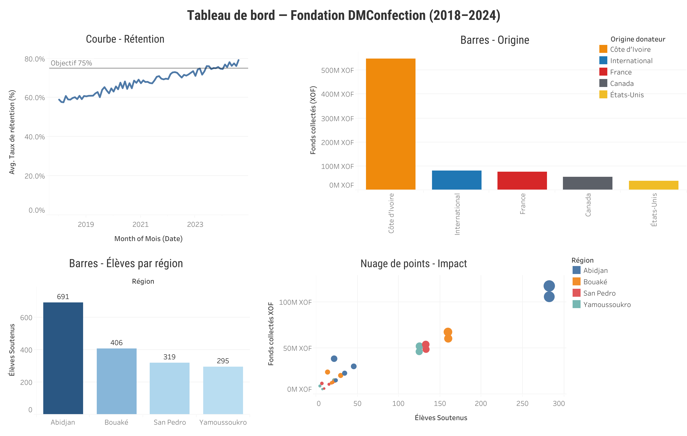

# NGO Donor & Impact Dashboard (Côte d’Ivoire)

## Project Overview
This project shows a donor and impact reporting dashboard I created for my NGO in Côte d’Ivoire, **Fondation DMConfection (2018–2024)**.  

We had a problem:  
- Four regional teams (Abidjan, Bouaké, San Pedro, Yamoussoukro) sent data in different formats.  
- Consolidation was slow, errors were common, and donor updates were delayed.  

My solution:  
- Standardized the reports with **Excel templates** (locked fields for consistency).  
- Used **VBA macros** to auto-calc totals and reduce manual errors.  
- Connected the data into **Power BI/Tableau** for real-time dashboards.  

This improved donor retention by **~20%** and raised on-time reporting to **95%**.  

---
## How I Built the Dashboard

1. **Data Prep**  
   - Collected donor + regional impact data (2018–2024).  
   - Standardized input using Excel templates with locked KPI fields.  
   - Cleaned and saved consolidated data as CSV (`NGO_Data_Final.csv`).  

2. **Tableau Setup**  
   - Connected the CSV as the main datasource.  
   - Built calculated fields for:
     - Donor Retention %
     - Students Supported (cumulative)
     - Funds Collected by Origin (XOF)
   - Added slicers for Region and Donor Origin.  

3. **Visuals**  
   - **Line chart**: Donor retention % over time.  
   - **Bar chart**: Funds collected by donor origin (Côte d’Ivoire, France, UNESCO).  
   - **Map**: Students supported by region.  
   - **Scatterplot**: Relationship between funds raised and students supported.  

4. **Automation**  
   - Power BI refresh connected to central SharePoint folder (auto-updated CSV).  
   - Stakeholders had access to the online dashboard anytime.
  
---

## Dashboard Highlights
- **Retention Curve** → donor retention rate over time, benchmarked at 75%.  
- **Donor Origins** → funding sources (Côte d’Ivoire, France, UNESCO, etc.).  
- **Regional Impact** → number of students supported by each region.  
- **Impact Scatterplot** → link between funds raised and students supported.  

---

## Dataset
The dataset (`NGO_Data_Final.csv`) contains:  
- Year, Month  
- Region (Abidjan, Bouaké, San Pedro, Yamoussoukro)  
- Donor Origin (Local, International, UNESCO, etc.)  
- Funds Collected (XOF)  
- Students Supported  
- Retention Rate (%)  

---

## Tools Used
- **Excel** → templates + macros for automation  
- **Power BI/Tableau** → dashboard and reporting  
- **CSV** → structured dataset for reproducibility  

---

## Impact
- Donor retention grew from **60% → 80%** (2018–2024).  
- Over **700 students** supported.  
- New donors onboarded (UNESCO in 2023).  
- Gave stakeholders **clear visibility** and faster updates.  

---
